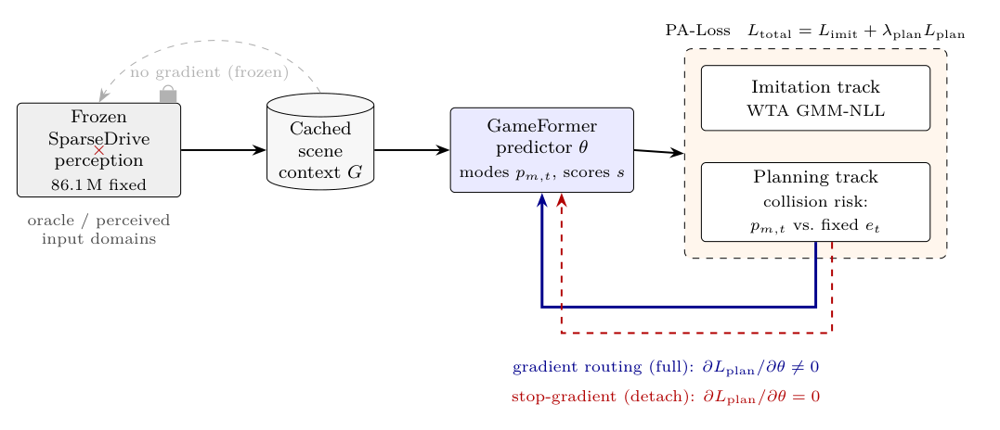

<h1 align="center">Does Planning Risk Reshape the Predictor?</h1>

<p align="center">
  A stop-gradient test for planning-aware trajectory prediction
</p>

<p align="center">
  
  
  
  
</p>

<p align="center">
  
</p>

Several planning-aware objectives route a downstream signal into prediction
training. None of them establishes **where the resulting gradient lands** —
whether the predictor changed, or only the planner that consumes its forecasts.
In a jointly trained system every component moves at once, so attribution is
lost by construction.

This repository contains the instrument that settles it. Two training arms
compute the *identical* objective on identical data and differ in one operation:

```python
# src/pa_loss_stopgrad/pa_loss/pa_loss_gameformer.py:173
plan_modes = neighbor_modes.detach() if stop_gradient else neighbor_modes
```

Because the plan reference is a recorded trajectory rather than the output of a
trained planner, the only differentiable quantity in the planning term is the
predicted neighbour position. The planning gradient can therefore reach the
predictor and nothing else — which is what makes the comparison a threshold
rather than an ordinary ablation. An ablation removes a component and asks
whether performance drops, conflating the component's presence with its effect
on any particular parameter. Here the component is present in both arms and the
objective value is the same.

You can watch it happen on synthetic tensors, with no dataset and no GPU:

```console
$ python scripts/check_pa_loss_gradients.py
full_loss:                          0.5009889602661133
stop_gradient_loss:                 0.5009889602661133
full_prediction_grad_norm:          0.016270417720079422
stop_gradient_prediction_grad_norm: 0.0
passed: True
```

Same loss, different gradient. The test is cheap and carrier-agnostic: any
planning-aware objective whose plan reference is not itself differentiable
admits it.

## Results

Under a frozen-perception protocol on nuScenes, at a displacement-controlled
working point (guard-cap = 1.5x the control's final minADE):

| | stop-gradient | full | change |
|---|---|---|---|
| collision proxy, oracle global | 0.357 | **0.223** | −37.5 % |
| collision proxy, oracle high-conflict | 0.768 | **0.577** | −24.9 % |
| collision proxy, perceived global | 0.422 | **0.273** | −35.4 % |

Four of four bootstrap intervals separate, and the separation survives three
risk surrogates, two prediction carriers, and both oracle and perceived inputs.
Regenerate the interval plot from committed results, no training required:

```bash
python figures/make_fig3.py
# oracle global  full 0.222 [0.213, 0.231] | sg 0.355 [0.345, 0.364]  (non-overlap)
```

**What did not work, reported as results.** Mode-level risk weighting is a
carrier-dependent null. Under a fixed library planner the predictor gain does
not reach the planning layer at all. The collision *rate* remains a tie
throughout. The accuracy cost is real — mean minADE runs 1.5–1.8x the
control's.

This is a controlled attribution, not a leaderboard result.

## Quick start

```bash
pip install -e ".[dev]"
git clone https://github.com/MCZhi/GameFormer.git third_party/GameFormer
cd third_party/GameFormer && git checkout fcb0d4a0f5cbbcecf69f9b9796366d6f5f2ce128 && cd ../..

pytest tests/ -q                          # 103 passed, 1 skipped
python scripts/check_pa_loss_gradients.py # the instrument, on synthetic tensors
python figures/make_fig3.py               # the headline intervals, from committed results
```

None of those three needs nuScenes or a GPU.

[**REPRODUCE.md**](REPRODUCE.md) maps every number in the paper to the command
that produces it, including the negative results, and states plainly what this
repository *cannot* reproduce on its own.

## Layout

```
src/pa_loss_stopgrad/
  pa_loss/      the planning-aware loss and the stop-gradient control
                three risk surrogates: Gaussian, time-to-collision, oriented-box
  carriers/     GameFormer adapter + a lightweight recurrent probe
  perception/   frozen-SparseDrive export and the adapter into the carrier
  planners/     frozen shared planner probe, fixed library planner
  eval/         displacement + safety metrics, high-conflict subset, bootstrap
  paths.py      every data location, overridable by environment variable
scripts/        17 entry points: training, evaluation, statistics
tests/          103 tests, no data or GPU required
results/        committed bootstrap output behind the headline intervals
figures/        paper figure generation
```

## Environment

The reported results come from three separate environments, because the
perception stack and the predictor stack pin incompatible dependencies:

| stage | Python | key packages | hardware |
|---|---|---|---|
| predictor training, PA-Loss, evaluation | 3.10 | torch 2.5.1+cu121 | A100 80GB, CUDA 12.2 |
| frozen perception export (SparseDrive) | 3.8 | torch 1.13.0+cu116, mmcv 1.7.1, mmdet 2.28.2 | A100 80GB |
| nuScenes preprocessing | 3.10 | nuscenes-devkit 1.2.0, pyquaternion 0.9.9 | CPU |

`requirements.txt` pins the first, which is the one needed to read and run the
loss, the control and the metrics.

## Data and upstream code

Nothing here is a copy of an upstream repository.

- **GameFormer** ([MCZhi/GameFormer](https://github.com/MCZhi/GameFormer), ICCV
  2023) publishes **no licence**, so it is referenced at a pinned commit and
  cloned by you, never redistributed.
- **SparseDrive** ([swc-17/SparseDrive](https://github.com/swc-17/SparseDrive),
  MIT) and its released weights come from upstream.
- **nuScenes** (CC BY-NC-SA 4.0) is downloaded from
  [nuscenes.org](https://www.nuscenes.org/nuscenes).

See [THIRD_PARTY.md](THIRD_PARTY.md) for the full account.

## Acknowledgments

This work builds directly on GameFormer (Huang et al., ICCV 2023) as the
prediction carrier and SparseDrive (Sun et al., 2024) as the frozen perception
stack, and uses the nuScenes dataset (Caesar et al., CVPR 2020). The
contribution here is the training signal and the control that isolates its
effect, not the perception or prediction architectures, and the results would
not exist without those authors releasing their work.

## Citation

```bibtex
@mastersthesis{guo2026thesis,
  author  = {Guo, Xiyuan},
  title   = {Planning-Aware Trajectory Prediction: Routing Downstream Planning
             Risk into a Frozen-Perception Multimodal Predictor},
  school  = {McMaster University},
  address = {Hamilton, ON, Canada},
  type    = {{M.A.Sc.} thesis},
  year    = {2026}
}
```

A journal article condensing this work is under review; this section will be
updated when it appears.

## Licence

MIT — see [LICENSE](LICENSE).
